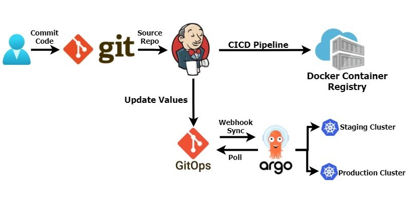

# Excercise 1:

## Setup the repositories, docker container registry, infrastructure automation and continuous delivery using Argo CD before integrate all in to a pipeline

#### • Create the Dockerfile for every app that we want to containerize, then in that file, include these instructions, line by line. In this scenario we can create 2 Dockerfiles for Client (React) & server.

• Select the OS needs to run the servers and write down the installation steps in the Dockerfile for each.

E.g.-:

o Install

o Clone the project to a directory on my host from my Git repo

o Install the dependencies from package.json

o Start the server

o Expose the service ports. So it can be accessed from the outside

• Create the separate repository for keep the infrastructure automation files terraform (Infrastructure as a code) and application deployment helm chart files. Create the separate storage to maintain the state of infrastructure using terraform state 

o Virtual network (VNET) creation in the cloud 

o Subnet creation

o Create a Kubernetes Cluster (AKS/EKS)

o Install the Argo CD in the Kubernetes cluster (GitOps continuous delivery tool for Kubernetes)

o Setup the DNS for access the application using the outside

o Create the network security rules

• Create the helm charts for the application front-end and back-end from the scratch and download the helm charts that already available for the mongoDB into the repo.

• Setup the Argo CD to deploy the new version of the application into the Kubernetes cluster using helm charts when pipeline triggers.

• Create the 2 Kubernetes clusters for Staging/Prod using infrastructure automation files and keep the state of the environments using the terraform state in cloud storage.

## Jenkins Pipeline

• After change the code, test it locally for bugs and then commit it to a source code management (GitHub)CI/CD Jenkins workflow

• Create the 2 separate branches for front-end and the back-end since the both front-end and back-end applications are in the same repository.

• Create the 2 Jenkins pipelines for staging and production. In the Jenkins setup the environment variables in Jenkins. E.g.-: KUBE_URL, KUBE_PASSWORD, KUBE_CA.PEM from created K8s cluster, USERNAME and PASSWORD for the docker registry.

• When commit the new changes to the branch trigger the pipeline. 

• Then pipeline should create the image of the applications and push it to the docker registry. (Better use case is to update the new image tag based on the commit id).

• Run the argo cd pipeline grab the changes and deploy the new application using helm charts of the applications.

• Run the automated test cases against the staging environment.

• If all the test cases pass, then trigger the pipeline to deploy the new application version in to the production environment.

### Pipeline workflow Architecture Diagram 

